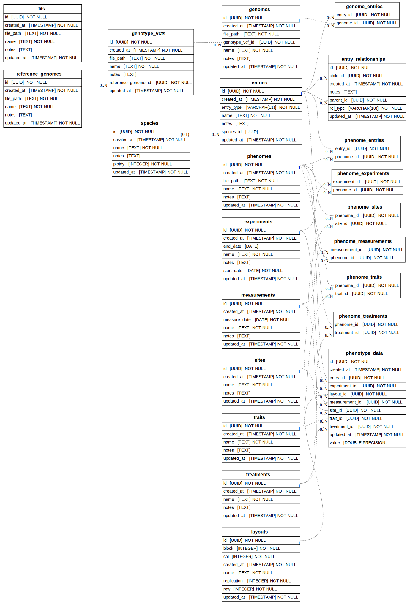

# GenomicBreedingDB

[](https://GenomicBreeding.github.io/GenomicBreedingDB.jl/stable/)
[](https://GenomicBreeding.github.io/GenomicBreedingDB.jl/dev/)
[](https://github.com/GenomicBreeding/GenomicBreedingDB.jl/actions/workflows/CI.yml?query=branch%3Amain)

The database schema is a **species-agnostic**, **entry-centric** breeding database designed to integrate pedigree, phenotype, genotype, and genomic prediction information within a single relational framework.

The architecture deliberately separates **data storage and management** from **computational analysis**:
- **PostgreSQL** serves as the authoritative repository for metadata and entity relationships while supporting basic data retrieval. Complex joins are largely delegated to the analytical layer to keep SQL queries simpler and more maintainable.
- **Julia** and [**GenomicBreeding**](https://github.com/GenomicBreeding) serves as the computational engine, performing complex joins and data transformations, managing large genomic and phenotypic matrices, and executing genomic prediction and statistical analyses.

This separation enables:
- efficient scaling to large genomic datasets,
- support for complex pedigree structures,
- integration with genomic prediction pipelines,
- improved reproducibility, and
- broad applicability across species and breeding programs.

## Quickstart

Assuming PostgreSQL has been setup ([see below for details](#postgresql-setup)):

### Uploads and downloads using simulated data

```julia
using GenomicBreedingDB.jl
# Simulate
genomes = simulate_genomes()
trials = simulate_trials(genomes)
phenomes = simulate_phenomes(trials)
fit = simulate_fit(genomes, phenomes)
# Uploads
upload("siumulated_trials.tsv")
upload("siumulated_environments.tsv")
upload("siumulated_reference_genome.fa")
upload("siumulated_genomes.vcf", fname_reference_genome="siumulated_reference_genome.fa")
upload("siumulated_genomes.jld2", fname_reference_genome="siumulated_reference_genome.fa")
upload("siumulated_phenomes.jld2")
upload("siumulated_fit.jld2")
# Downloads
# TODO....
```

### Input file formats

- Tab-delimited files (comma and other delimiters can also be used):
    + trial data (e.g. ["simulated_trials.tsv"](./res/simulated_trials.tsv))
    + environmental data (e.g. ["simulated_environments.tsv"](./res/simulated_environments.tsv))
- FASTA ([see specifications for details](https://en.wikipedia.org/wiki/FASTA_format))
    + reference genome file (e.g. ["simulated_reference_genome.fa"](./res/simulated_reference_genome.fa))
- VCF ([see specifications for details](https://samtools.github.io/hts-specs/VCFv4.2.pdf))
    + genotype data file (e.g. ["simulated_genomes.vcf"](./res/simulated_genomes.vcf))
- JLD2
    + [Genomes struct](https://genomicbreeding.github.io/GenomicBreedingCore.jl/dev/#GenomicBreedingCore.Genomes) (e.g. ["simulated_genomes.jld2"](./res/simulated_genomes.jld2))
    + [Phenomes struct](https://genomicbreeding.github.io/GenomicBreedingCore.jl/dev/#GenomicBreedingCore.Phenomes) (e.g. ["simulated_phenomes.jld2"](./res/simulated_phenomes.jld2))
    + [Fit struct](https://genomicbreeding.github.io/GenomicBreedingCore.jl/dev/#GenomicBreedingCore.Fit) (e.g. ["simulated_fit.jld2"](./res/simulated_fit.jld2))

## Database schema

### Core Design Principles

- Entries are the central biological entity, representing cultivars, populations, individuals, and families.
- Pedigrees are represented as a graph, allowing flexible relationships such as parentage, cloning, and population membership.
- Phenomic data are stored via star-schema design, linking entries to experiments, sites, treatments, layouts, measurement events, and traits.
- Environmental data are similarly stored via star-schema design, linking environmental variables to experiments, sites, treatments, layouts, and measurement events.
- Large genomic datasets and fitted models are stored externally as Julia/JLD2 objects, while PostgreSQL stores metadata, and relationships.
- The schema is applicable to both plant and animal breeding programs, avoiding species-specific assumptions.

### Assumptions

- Entry names are globally unique across all species.
- Phenotype data are represented as numeric values, with categorical traits encoded numerically.
- Biological validation rules (e.g. pedigree consistency) are primarily enforced in the database (i.e. an entry cannot be its own parent).
- Trait units are embedded within trait names (e.g. `yield_t_ha`, `height_cm`) instead of being managed through a separate units system.
- Pedigree structures may be incomplete, complex, or non-traditional, and stored as flexible relationships rather than fixed maternal/paternal columns.

### Data Types

#### Biological Entities
- Species
- Entries (`cultivar`, `population`, `individual`, `family`)
- Pedigree and membership relationships (`member_of`, `clone_of`, `parent_is`, `maternal_parent_is`, `paternal_parent_is`)

#### Experimental Metadata
- Experiments
- Sites
- Treatments
- Layouts (field or facility layout)
- Measurement events

#### Phenotypes
- Trait definitions
- Numeric phenotype observations
- Full experimental context for every observation

#### Genomics
- Reference genomes
- VCF datasets
- Genome objects (JLD2)
- Phenome objects (JLD2)
- Genomic prediction model objects (JLD2)

#### Relationships
- Explicit links between genome, phenome, fit, entry, trait, experiment, site, treatment, and measurement datasets.
- Supports reproducibility, traceability, and dataset lineage tracking.

#### Schema graph



## PostgreSQL setup

### 1. Install PostgreSQL with pixi, and initialise the server

```shell
cd GenomicBreedingDB.jl/
pixi init
pixi add postgresql
pixi run initdb -D ./pgsql_data
pixi run pg_ctl -D ./pgsql_data -l ./pgsql_data/logfile.txt start
pixi run psql postgres
# # Or using a specific port:
# PORT=5433
# pixi run pg_ctl -D ~/pgsql_data -l ~/pgsql_data/logfile.txt -o "-p $PORT" start
# pixi run psql -h localhost -p $PORT postgres
# pixi run createuser --interactive --pwprompt
# #!/bin/bash
# createuser \
#   --pwprompt \
#   --no-superuser \
#   --no-createdb \
#   --no-createrole \
#   "$@"
```

### 2. Instantiate the database

Open the PostgreSQL shell:

```shell
cd GenomicBreedingDB.jl/
pixi run psql postgres
```

Create a new database:

```sql
CREATE DATABASE gbdb;
\l
\c gbdb
\dt
CREATE USER himynamejeff WITH PASSWORD 'qwerty12345';
GRANT ALL PRIVILEGES ON SCHEMA public TO himynamejeff;
GRANT ALL PRIVILEGES ON DATABASE gbdb TO himynamejeff;
-- GRANT SELECT ON ALL TABLES IN SCHEMA public TO other_user;
-- \c postgres
-- DROP DATABASE gbdb;
-- \l
-- SELECT * FROM pg_database;
\q
```

### 3. Define the login credentials

```shell
cat > ~/.env << 'EOF'
DB_USER="himynamejeff"
DB_PASSWORD="qwerty12345"
DB_NAME="gbdb"
DB_HOST="localhost"
EOF
```

### 4. Initialise the tables

#### Start the database

```shell
cd GenomicBreedingDB.jl/
pixi run pg_ctl -D ./pgsql_data -l ./pgsql_data/logfile.txt start
# pixi run pg_ctl -D ./pgsql_data -l ./pgsql_data/logfile.txt stop
# pixi run pg_ctl -D ./pgsql_data -l ./pgsql_data/logfile.txt restart
```

#### Initialise the tables

1. Open julia, initialise GenomicBreedingDB.jl, and start an interactive Julia session:

```shell
cd GenomicBreedingDB.jl/
pixi run julia --project=. --threads=2,1 -e "using Pkg; Pkg.instantiate()"
pixi run julia --project=. --threads=2,1 --load test/interactive_prelude.jl
```

2. Initialise tables using the `./db/schema.sql`:

```julia
# Initialise the database
dbinit()
# Open a connection to the database, list all the tables initialised, and close the connection
conn = dbconnect()
extract_all_tables(conn)
close(conn)
```

## Database schema visualisation

```shell
cd GenomicBreedingDB.jl
pixi run eralchemy -i postgresql://himynamejeff@localhost:5432/gbdb -o db/graph.svg
```

## Dev stuff:

### REPL prelude

```shell
julia --project=. --threads=2 --load test/interactive_prelude.jl
```

### Format and test

```shell
time julia --project=. --threads=2 -e "using Pkg; Pkg.update()"
time julia --project=. --threads=2  test/cli_tester.jl
```
